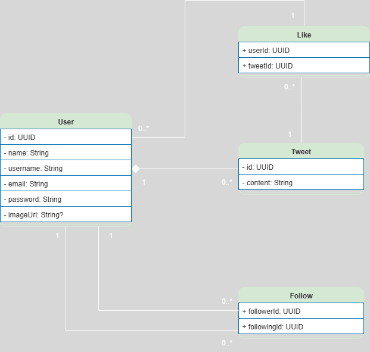

# 

## 🎯 Desafio

Desenvolver uma API REST do **Growtwitter**, uma rede social inspirada no Twitter, utilizando **Node.js**, **TypeScript**, **Express.js**, **PrismaORM** e **PostgreSQL**. O projeto inclui autenticação de usuários, criação de tweets e replies, curtidas, sistema de seguidores e feed personalizado. Ao final, será necessário realizar o deploy da API e publicar o código no **GitHub**. A atividade consolida habilidades práticas em desenvolvimento back-end.

---

## 🧩 Modelo de Dados

O diagrama abaixo representa as entidades e relações do projeto.

---

## 🛠️ Pré-requisitos

- Node.js
  ● Typescript
  ● Express.js
  ● API Rest
  ● Programação Orientada a Objetos
  ● PostgreSQL
  ● PrismaORM

---

## 📋 Regras e requisitos da entrega

1. Criar uma API REST para o Growtwitter com Node.js, Typescript e
   Express.js.

2. Usar um banco de dados PostgreSQL e o PrismaORM para a
   persistência dos dados.

3. O sistema deve ser composto por usuários e tweets. Deve ser
   possível ao usuário fazer login na sua conta. A autenticação deve ser
   feita com username/email e senha.

4. Um usuário autenticado pode tweetar na sua conta, curtir os tweets
   de outros usuários (inclusive os próprios tweets) ou tweetar como
   resposta a outro tweet qualquer.

5. Um tweet pode conter 0 ou N replies.

6. Um usuário autenticado pode seguir outros usuários, bem como
   pode ser seguido por outros usuários.

7. Um usuário não pode seguir a si mesmo.

8. O usuário deve ser composto pelo menos por: ID, nome, username
   ou e-mail, senha e imagem de perfil (apenas URL).

9. O tweet deve ser composto pelo menos por ID e conteúdo e deve
   pertencer a um único usuário.

10. Após concluído o desenvolvimento, você deverá realizar o Deploy da
    sua API utilizando os serviços Render ou Vercel.

11. A entrega do desafio envolve o envio do link para o repositório no
    Github e o link do Deploy. Além disso, o repositório deve estar em
    modo Público para que possamos analisar o código implementado
    e gerar seu feedback.

12. O projeto só será considerado como entregue, mediante ao envio de
    ambos os links (repositório e deploy).

---

👩‍💻 Autor(a)

Desenvolvido por Iara Tassi durante a formação Desenvolvimento Web Full Stack.
